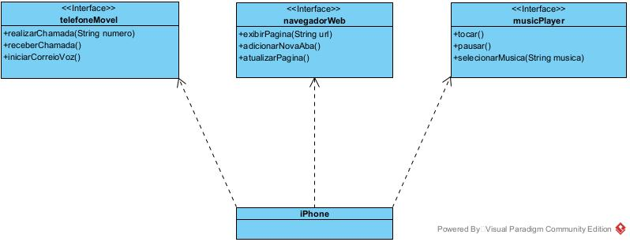

## Desafio

Uma implantação teórica de um aparelho IPhone utilizando modelagem de classes em UML.

## Modelo UML 

A diagramação UML foi realizada medianta a ferramenta Visual Paradigm Community Edition, chegando ao modelo abaixo representado:

## Implementação em Java 

A implementação em Java foi realizada conforme as interfaces e classe do diagrama UML. 

